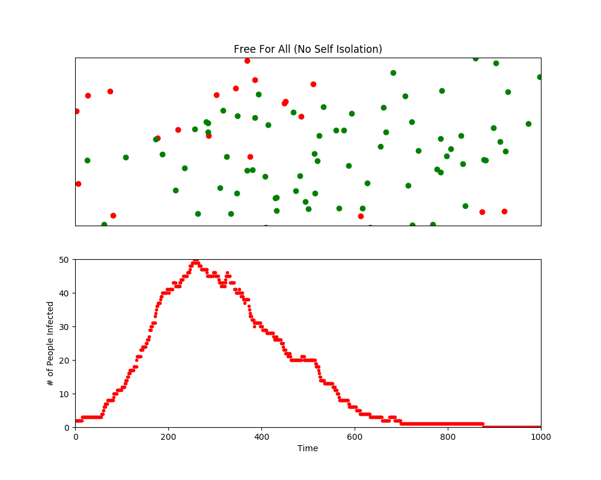
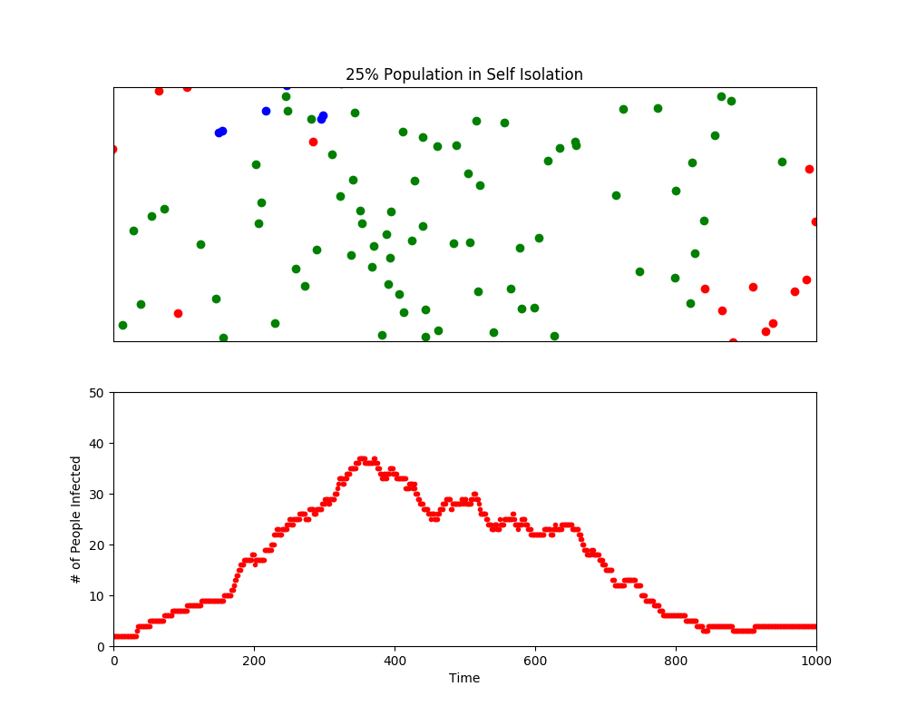
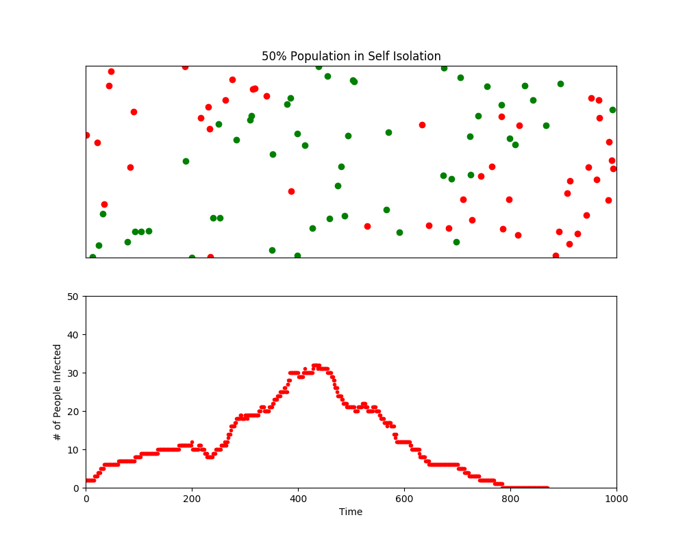

# Pandemic Simulator (COVID-19)
Self-isolation and “Social Distancing” are terms that have become synonymous with the spread of COVID-19. Numerous governments and health organizations, such as the CDC, have stated that Self-isolation is crucial to stopping the spread of COVID-19; if people are not in close proximity to each other, there is little chance of the virus spreading. Furthermore, self-isolation will help alleviate stress from burdened ICU units, ensuring that everyone who may eventually need critical care will be able to get it.

This program visualizes the effects of Social Distancing and self-isolation and how simple steps taken by individuals can have a large impact on the crisis at hand. The simulation is based off the SIR model, in which individuals are categorized into 4 groups:
    * Infected
    * Recovered
    * Susceptible
Those who have been infected, then recovered cannot contract the infection again, nor can they infect other people after they have recovered. 

## Simulation 1: No Self-Isolation

**Peak # of People Infected: 51**

This model simulates a population in which no one is practicing self-isolation. The rise in infections is sharp and sudden. This scenario, similar to what has occurred in Italy, is the type of scenario that would overrun healthcare systems. Because the number of total infections is so high, there is not enough room in hospitals to accommodate everyone that needs care. The overburdened healthcare system ultimately results in high death rates. 

## Simulation 2: 25% in Self-Isolation

**Peak # of People Infected: 39**

This scenario simulates a population in which 25% of people are practicing self-isolation. The peak number of people infected during this pandemic simulation is considerably lower than that of Simulation 1. 

## Simulation 3: 50% Population in Self-Isolation

**Peak # of People Infected: 35**

The third simulation results in an even lower peak. Furthermore, the number of infected people is 0 at the approximate time of 800. Increased self-isolation has resulted in a lower peak and an earlier end to the pandemic!

This simulation is not intended to overrule any medical/professional advice. Rather, the purpose is to visualize the importance of Social Distancing and Self-isolation.  For the most up to date statistics and advice, visit the CDC website!
